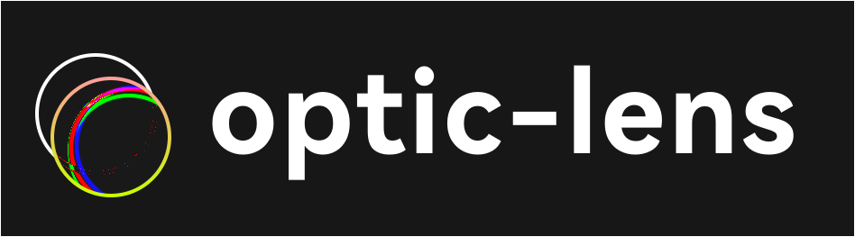
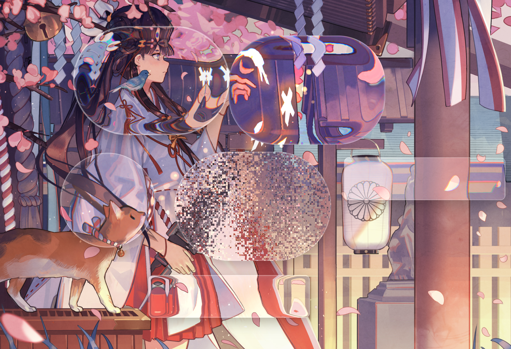

# optic-lens — Optical Lens Filters

[English](README.md) | [中文](README.zh-CN.md)

[](https://www.npmjs.com/package/optic-lens)

<p align="center">
  
</p>

Optical lens-style filter effects for the frontend. Supports multiple filters such as liquid glass, fisheye, magnifier, and more.

You can generate filter effects standalone, apply them to page elements, or create draggable elements directly.

Supports customizable size, curvature, border radius, edge softening, chromatic aberration, debug mode, and drag-and-drop.

**Demo:** [http://optic.play.kt.sb/](http://optic.play.kt.sb/)

## Supported Filters

TODO: Some filters are not fully implemented yet; see the demo for parameter effects vs. actual results.

TODO: Vue/React/Solid plug-and-play component support.

| Name | Description | Parameters | Typical Effect |
|------|-------------|------------|----------------|
| Glass | Liquid glass | width, height, radius, depth, blurAmount | Realistic glass depth of field, local blur |
| Fisheye | Fisheye | width, height, borderRadius, curvature | Center bulge distortion, fisheye perspective |
| Cylindrical | Cylindrical | width, height, borderRadius, curvature, axis | Horizontal/vertical cylindrical bending |
| Spherical | Spherical | width, height, borderRadius, curvature, edgeSoftness, chromaticAberration | Omnidirectional spherical Gaussian distortion / chromatic aberration |
| Magnifier / Reading Glass | Magnifier | width, height, borderRadius, magnification | Local magnifier effect |
| Prism | Prism | width, height, borderRadius, orientation, intensity, dispersion, blurAmount | Distortion / reflection / dispersion |
| Kaleidoscope | Kaleidoscope | width, height, segments, borderRadius | Special kaleidoscope effect |
| Random Filter | Random noise | width, height, intensity, grain | Background random scrambling |

Each filter supports custom shape, strength, and edge transition via parameters, plus debug mode (displacement map overlay) and drag-and-drop.

## Quick Start

Install:

```bash
npm install optic-lens
```

Usage examples:

### 1. Generate Filter Effect Standalone

Generate an SVG filter URL for custom use:

```typescript
import { Glass, FisheyeLens } from "optic-lens";

// Generate filter effect URL
const filterUrl = Glass.createFilter({
  width: 300,
  height: 200,
  radius: 20,
  depth: 12,
  strength: 100,
});

// Apply to element
const element = document.querySelector('.my-element');
element.style.filter = `url('${filterUrl}')`;
```

### 2. Apply to Page Elements

Apply filter effects to existing DOM elements:

```typescript
import { Glass, FisheyeLens } from "optic-lens";

// Apply to existing element
const existingElement = document.querySelector('.my-element');
Glass.apply(existingElement, {
  width: 300,
  height: 200,
  radius: 20,
  depth: 12,
  strength: 100,
  blur: 3,
});
```

### 3. Create Draggable Elements

Create filter elements with built-in drag support:

```typescript
import { Glass, FisheyeLens } from "optic-lens";

// Create draggable glass filter element
const glassEl = Glass.createDraggable({
  width: 300,
  height: 200,
  radius: 20,
  depth: 12,
  strength: 100,
  initialX: 80,   // Initial X position
  initialY: 120,  // Initial Y position
});

document.body.appendChild(glassEl);

// Create draggable fisheye filter element
const fisheyeEl = FisheyeLens.createDraggable({
  width: 220,
  height: 220,
  borderRadius: '50%',
  distortion: 1.5,
  edgeSoftness: 0.2,
});

document.body.appendChild(fisheyeEl);
```
